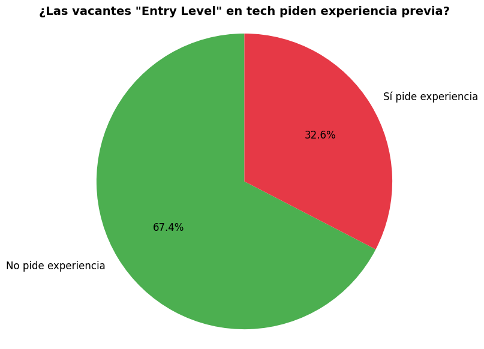
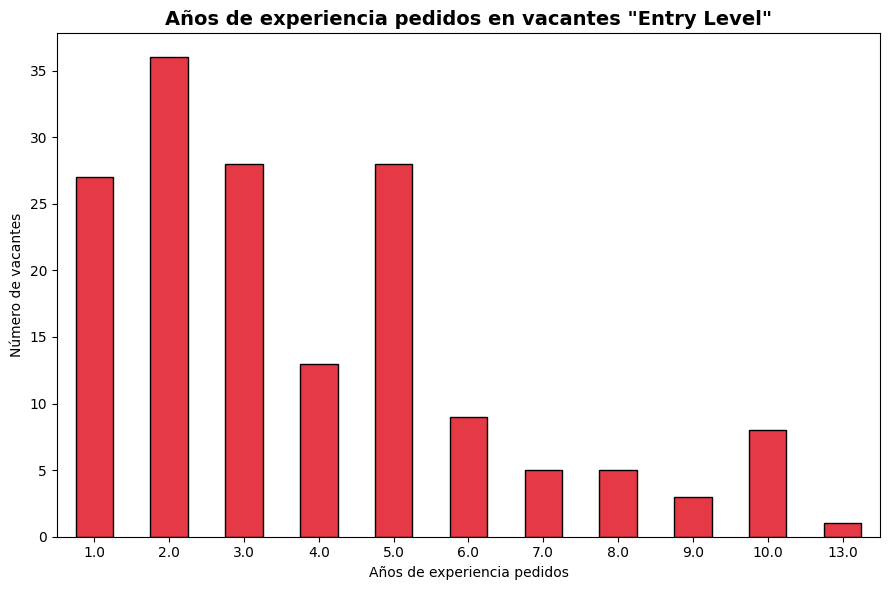
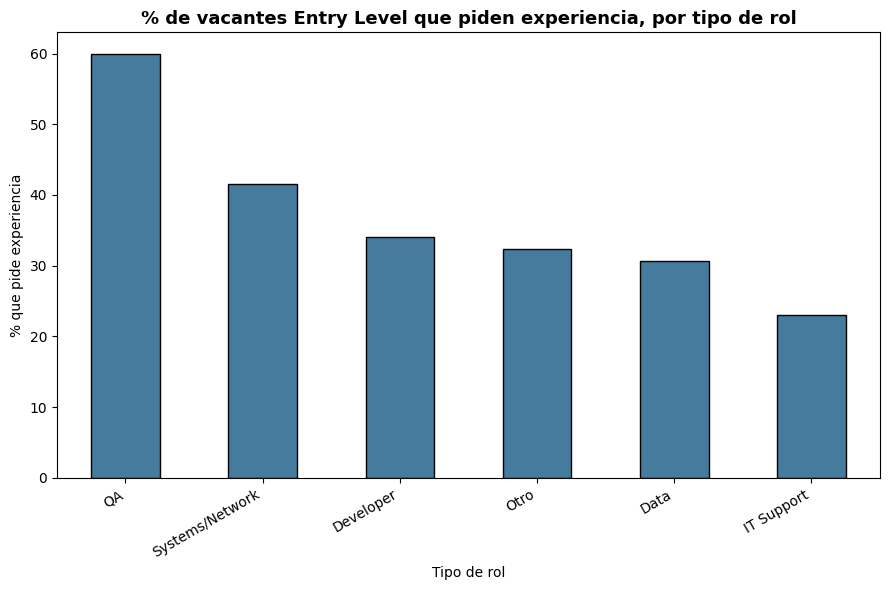

# DataMiningIA — ¿Son realmente "Entry Level" las vacantes junior en tech?

**Autora:** Stefania Borja, estudiante de Ingeniería de Sistemas — Universidad EAN
**Contexto:** Trabajo final de la ruta formativa Data Mining con IA: Análisis de Valor Empresarial

**Video Explicativo del trabajo: https://youtu.be/9ZeRr1VDjy4**

## 🎯 Objetivo y pregunta central

Este proyecto investiga una contradicción común en el mercado laboral tecnológico: vacantes etiquetadas oficialmente como **"Entry Level"** (nivel de entrada) que, en la práctica, exigen años de experiencia previa — la queja frecuente de que "las empresas ya no quieren contratar y entrenar, quieren gente ya entrenada".

**Pregunta de investigación:**
> ¿Qué proporción de las vacantes de tecnología etiquetadas como "Entry Level" en LinkedIn realmente exigen experiencia previa, y cuántos años en promedio?

Este análisis se realizó con apoyo de IA (Claude) en cada etapa: para refinar la pregunta de investigación, escribir y depurar el código de limpieza y extracción de texto, diseñar las visualizaciones, y redactar las conclusiones.

## 📊 Fuente de los datos

- **Dataset:** [LinkedIn Job Postings (2023-2024)](https://www.kaggle.com/datasets/arshkon/linkedin-job-postings) — 124,000+ vacantes reales publicadas en LinkedIn, recolectadas mediante scraping (código público en [GitHub](https://github.com/ArshKA/LinkedIn-Job-Scraper)).
- **Por qué este dataset:** a diferencia de datasets sintéticos/generados encontrados durante la búsqueda (ej. varios "AI Jobs Dataset 2026" que resultaron ser datos artificialmente escalados), este es 100% real y verificable.
- **Muestra final analizada:** 500 vacantes, filtradas y recortadas a partir de 909 vacantes "Entry Level" específicas de roles tech/sistemas (Developer, Data, IT Support, Systems/Network, QA).

## 🧹 Proceso de limpieza y preparación

1. Se filtró el dataset completo (123,849 filas) por `formatted_experience_level == 'Entry level'`.
2. Se aplicó un filtro de palabras clave específicas de tech/sistemas (developer, engineer de software, IT support, data scientist, etc.), excluyendo explícitamente roles de otros campos que también usan la palabra "engineer" (eléctrico, mecánico, manufactura, civil).
3. Se descartaron vacantes con descripciones muy cortas (<100 caracteres), poco útiles para el análisis de texto.
4. Se tomó una muestra aleatoria reproducible de 500 filas (`random_state=42`).
5. Se construyó una función de extracción de texto (regex) para detectar menciones de años de experiencia requeridos, iterada varias veces para evitar falsos positivos (ej. "100+ years in business" o "at least 16 years old" siendo confundidos con requisitos de experiencia laboral).

## 🔍 Técnica de minería de datos aplicada

- **Extracción de patrones de texto (regex/NLP básico)** para detectar menciones explícitas de años de experiencia dentro de las descripciones de las vacantes.
- **Clasificación por categoría de rol** (Developer, Data, IT Support, Systems/Network, QA, Otro) para comparar la contradicción entre distintos tipos de puesto.
- **Estadística descriptiva** (proporciones, promedio, mediana) para cuantificar el hallazgo principal.

## 📈 Resultados

### 1. Proporción que pide experiencia

**32.6%** de las vacantes "Entry Level" en tech piden explícitamente años de experiencia previa.

### 2. Distribución de años pedidos

Entre las vacantes que sí piden experiencia, la mediana es de **3 años**, concentrándose la mayoría entre 2 y 5 años.

### 3. Comparación por tipo de rol

| Categoría | % que pide experiencia | Vacantes analizadas |
|---|---|---|
| QA | 60.0% | 10 |
| Systems/Network | 41.5% | 65 |
| Developer | 34.0% | 94 |
| Otro | 32.4% | 136 |
| Data | 30.6% | 121 |
| IT Support | 23.0% | 74 |

## 💡 Conclusiones

- Casi **1 de cada 3** vacantes "Entry Level" en tech contradice su propia etiqueta, pidiendo experiencia previa real (mediana de 3 años).
- Los roles de **QA y Systems/Network** muestran la mayor contradicción, mientras que **IT Support** es el más consistente con lo que dice ser.
- Este hallazgo, basado en datos de 2023-2024, es consistente con reportes más recientes sobre el mercado laboral tech:
  - [SignalFire - State of Talent 2026](https://signalfire.com/state-of-talent/): la contratación junior en las grandes tech cayó 65% (y 75% en startups) desde 2019.
  - [Stanford Digital Economy Lab](https://digitaleconomy.stanford.edu/publications/canaries-in-the-coal-mine/): el empleo de programadores de 22-25 años cayó ~20% desde el lanzamiento de ChatGPT.
  - [Indeed Hiring Lab](https://www.hiringlab.org/): las vacantes "entry-level" en tech cayeron 25% interanual en 2024.
- En conjunto, estos datos sugieren que la etiqueta "Entry Level" se ha vuelto, en muchos casos, más una formalidad que un reflejo real de los requisitos del puesto.

## ⚠️ Limitaciones

- La categoría **QA solo tiene 10 vacantes** en la muestra — su 60% no es estadísticamente robusto y debe leerse con cautela.
- El dataset es de 2023-2024; no captura cambios más recientes en el mercado (2025-2026), aunque se complementa con fuentes actuales citadas arriba.
- La extracción de años de experiencia se basa en expresiones regulares sobre texto en inglés; puede no capturar todas las formas posibles de redactar un requisito de experiencia (ej. frases muy indirectas o implícitas).
- El filtro de categorías de rol es una simplificación; algunos títulos ambiguos pudieron clasificarse en "Otro" cuando encajaban mejor en una categoría específica.

## 🛠️ Herramientas utilizadas

- **Python** (Google Colab): `pandas`, `re`, `matplotlib`
- **Kaggle API** para la descarga del dataset
- **IA (Claude)** como asistente en cada etapa del proceso
